# Implementation of a neural network from scratch in Python

This repository contains a python implementation of a feed forward artificial neural network (ANN) based on multi-layer perceptron (MLP) model.

**NOTE**: the present tutorial is not a complete and comprehensive guide to neural network, rather it is intended to build some basic skills and get familiar with the concepts.

## Model

ANN is a collection of interconnected neurons that incrementally learn from their environment (data) to capture essential linear and nonlinear trends in complex data, so that it provides reliable predictions for new situations containing even partial and noisy information.

The model adopted in this implementation refers to the multi-layer perceptron model with a single hidden layer (three-layer neural network), which is represented in the following figure.

<p align="center">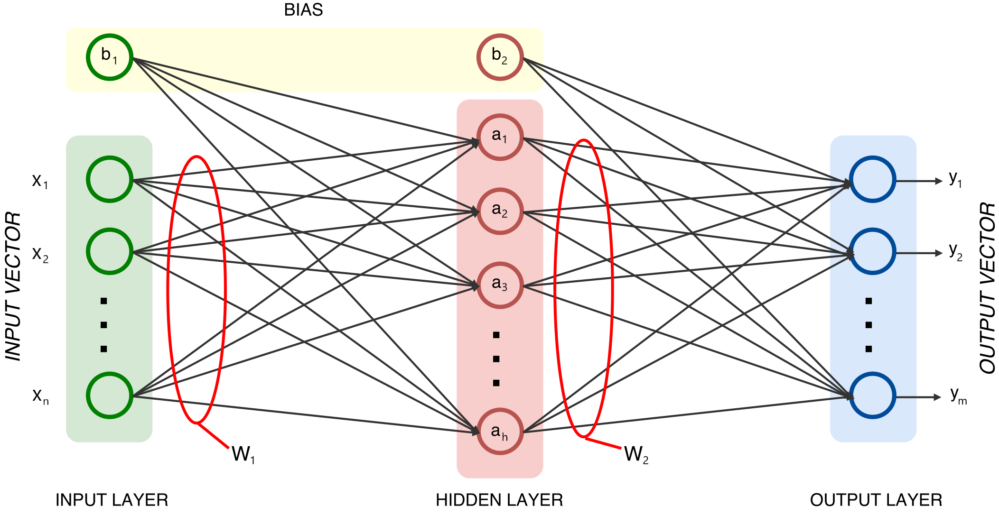</img><p>

A three-layer neural network corresponds to a function 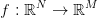 </img> with 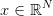</img> and 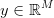</img>.

### Feed-forward propagation
At the very beginning, all weights are initially set to a weighted random number from a normal distribution (i.e., 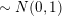</img>), whilst the biases are set to zero.

Then, it is possible to compute the propagation forward through the network to generate the output value(s).

The hidden node values are given by:

<p align="center">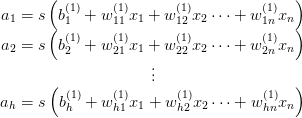</img><p>

Then, using this result it is possible to compute the output node values:

<p align="center">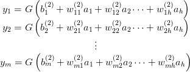</img><p>

However, it is also possible to use a matrix notation:

<p align="center">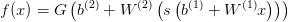</img><p>

where:
* 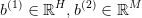</img> are the bias vectors;
* 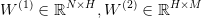</img> are the weight matrices;
* 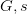</img> are the activation functions.

### Activation function

For the activation function it has been used the hyperbolic tangent, but you can choose the sigmoid function as well.

<p align="center">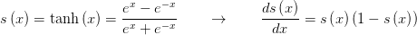</img></p>

<p align="center">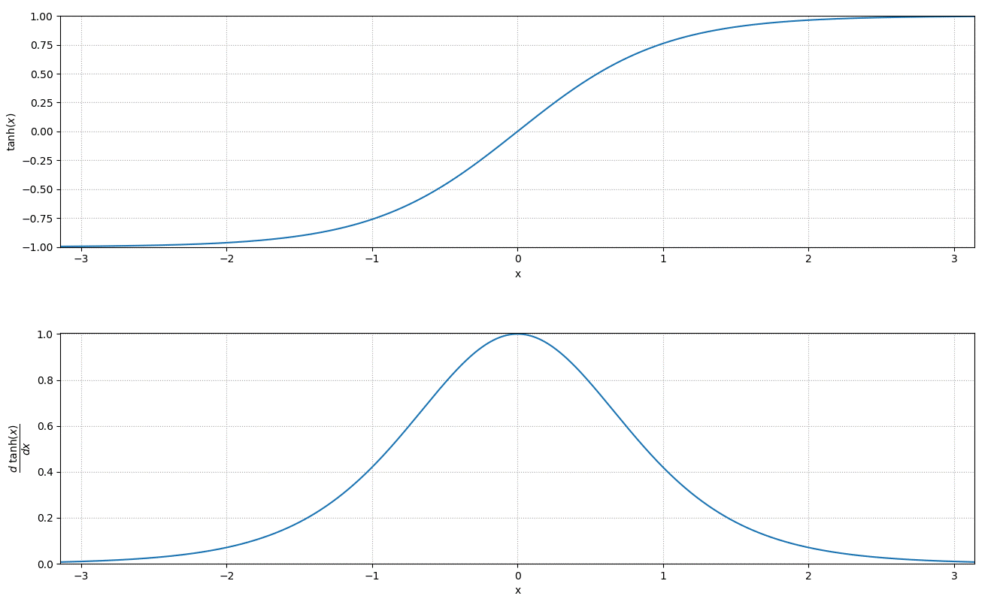</img></p>

### Classification

Classification is done by projecting an input vector onto a set of hyperplanes, each of which corresponds to a class.

The distance from the input to a hyperplane reflects the probability that the input is a member of the corresponding class.

The probability that an input vector 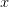</img> is a member of a class 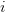</img> is:

<p align="center">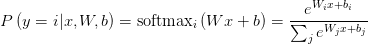</img></p>

The model's prediction 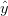</img> is the class whose probability is maximal:

<p align="center">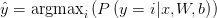</img></p>

### Training and backpropagation

The training of the network takes place through the backpropagation algorithm used in conjunction with the stochastic gradient descent optimisation method.

The total error (loss function) is given by the sum of squared errors of prediction, which is the  sum of the squares of residuals (deviations predicted from actual empirical values of data):

<p align="center">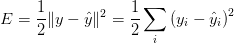</img></p>

The goal in this step is to find the gradient of each weight with respect to the output:

<p align="center">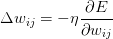</img></p>

where 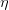</img> is the learning rate, which should be tuned to ensure a fast convergence of the weights to a response, without oscillations.


Now it is possible to apply the chain rule to back propagate the error in order to update the weight matrix and bias vector (the math part is not reported here).

## Usage

To import the module type the following command

```python
# import the module
import NeuralNetwork
```

Then you can define your own neural network with custom number of inputs, hidden neurons, and output neurons

```python
# define the number of neurons in each layer
no_inputs  = 2
no_hiddens = 7
no_outputs = 2

# constructor
ann = NeuralNetwork.MLP([no_inputs,no_hiddens,no_outputs])
```

where the activation function is set by default to be the hyperbolic tangent.

Then, given a training dataset `xt, yt` and a test dataset `x`

```python
# train the neural network
ann.train(xt, yt)

# output prediction
y_pred = ann.predict(x)
```

### Test #1: logical exclusive OR (XOR)

This is a classical non–linearly separable problem for logical XOR with noisy inputs.

The truth table of the logical exclusive OR (XOR) shows that it outputs true whenever the inputs differ:

| 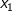</img> | 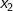</img> | 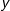</img> |
|:-:|:-:|:-:|
| 0 | 0 | 0 |
| 0 | 1 | 1 |
| 1 | 0 | 1 |
| 1 | 1 | 0 |

* input: 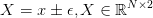</img>
* training set: </img>
* the output consists of 2 classes

The test dataset is a dataset that is independent of the training dataset, but that follows the same probability distribution as the training dataset.

The model is initially fit on the training dataset, so we can take a look at the loss per epoch graph. The figure below shows that the loss monotonically decreasing towards a minimum, which is consistent with the gradient descent optimisation algorithm.

<p align="center">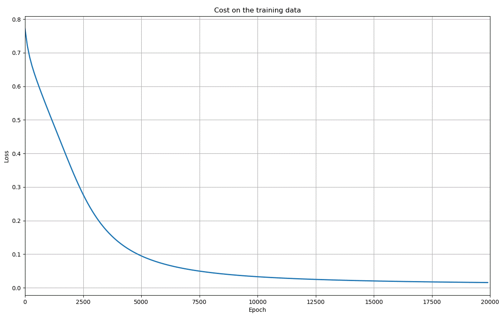</img><p>

Let's look at the final prediction (output) using the implemented Artificial Neural Network with 7 neurons in hidden layer </img>.

<p align="center">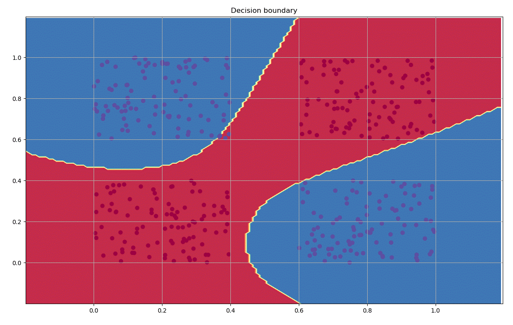</img><p>

As you can see, the neural network has been able to find a decision boundary that successfully separates the classes.

### Test #2: multiple classes prediction

This is another non-linearly separable problem where the dataset consists of four (noisy) spirals rotated by a fixed angle </img> between them.

* input: </img>
* training set: </img>
* the output consists of 4 classes

The figure below shows that the loss monotonically decreasing towards a minimum, which is consistent with the gradient descent optimisation algorithm.

<p align="center">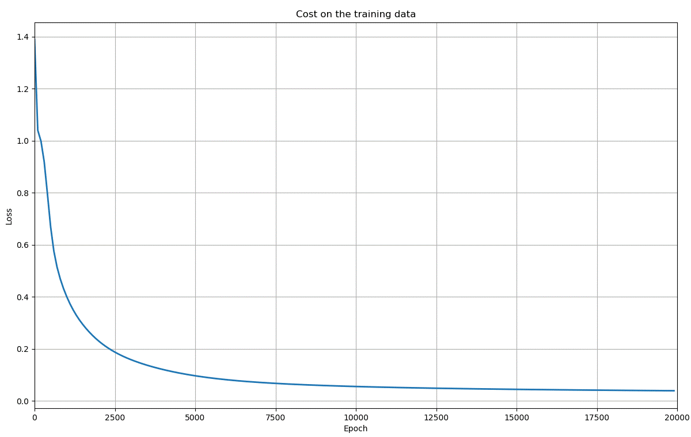</img><p>

Let's look at the final prediction (output) using the implemented Artificial Neural Network with 15 neurons in hidden layer </img>.

<p align="center">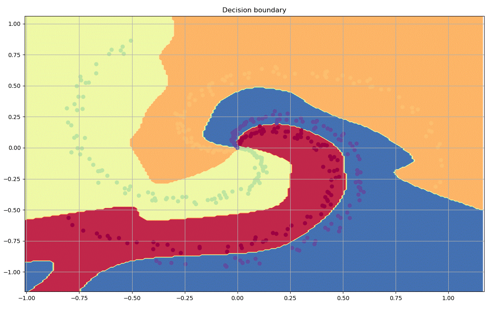</img><p>

As you can see, the neural network has been able to find a decision boundary that successfully separates the classes.

## License

This project is licensed under the MIT License - see the [LICENSE](LICENSE) file for details.
